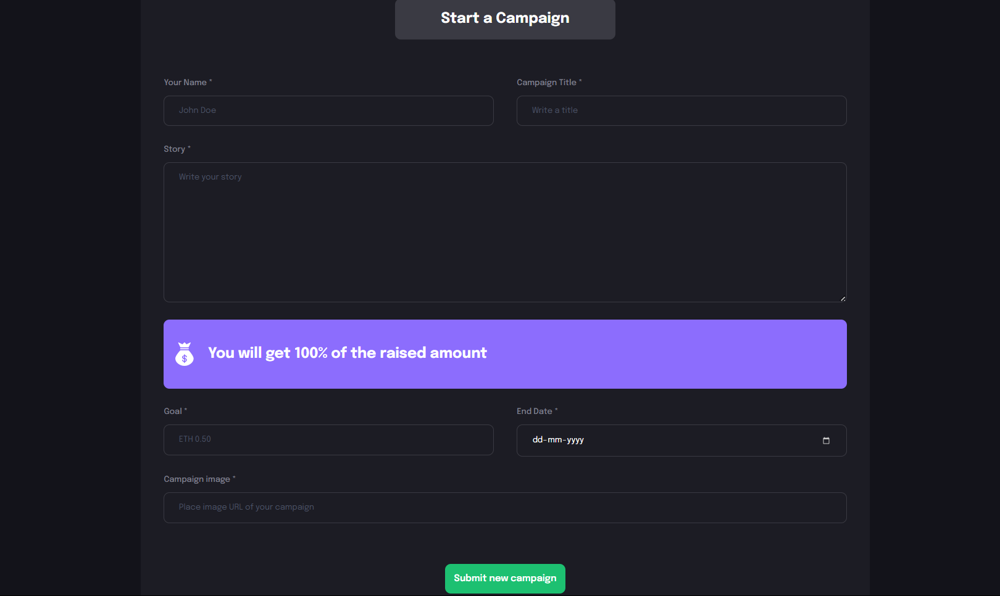

## Getting Started

```bash
git clone ...
cd client 

npm install
npm run dev

```

### Intro 

This Decentralized  Application (DApp) demonstrates a platform for individuals to create campaigns and receive donations for their projects or humanitarian causes.

### Tech Stacks :
- React
- TailwindCSS
- Javascript
- Solidity
- Thirdweb -  A Web3 development framework for creating, releasing, and deploying smart contracts.

#### Project Structure
- Front-end Parts: Located in the client folder.
- Back-end Parts (solidity): Located in the web3 folder.


### Blockchain Importance 
- Transparency: All transactions and campaign activities are recorded on the blockchain, ensuring transparency and preventing fraud.
- Security: Blockchain technology ensures that all donations are securely processed and stored.
- Decentralization: The platform operates without a central authority, giving users complete control over their campaigns and funds.
- Trust: The smart contract logic guarantees that funds are handled according to the campaign's rules, building trust among donors and campaign owners.


***





